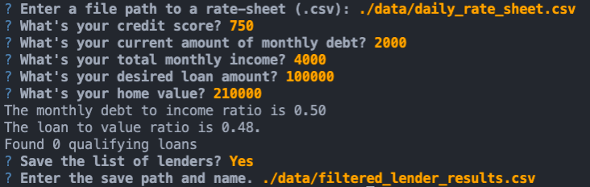

# Screen-A-Lender

**Have you ever tried to find a lender and struggled to separate the dirt from the gold?**  
*If so, then Screen-A-Lender is designed for you!*

This python command-line interface application allows you to upload your list of every lender into the 
    app, your basic financials, and the loan you want, and it will filter your huge list 
    down to just the ones that fit your tailored situation! No more shall you have dozens of tabs open, or submit unneeded applications to lenders 
    that will do nothing more than cause hurtful hard inquiries!

---

## Technologies

This app utilizes the following:
- Python (version 7.3.10 or higher)
- [fire](https://github.com/google/python-fire) - Fire instructions.
- [questionary](https://github.com/tmbo/questionary) - Interactive questions in the CLI
- Basic user skills with your Command Line Interface [CLI][https://medium.com/swlh/how-to-use-the-command-line-interface-cli-9c8b70e568e]
- A list of all possible lenders saved as a `.csv` file

---

## Installation Guide & Usage

Prior to using the program, you will need to have all the above requirements. To do so, perform the following:

Install Fire & Questionary:
```python
  pip install fire
  pip install questionary
```

**The following will provide instruction on how to access and use this software**

* Clone the code from this repository into the desired location and run `app.py` using: 
```python
python app.py
```

* You will now be prompted to enter:
    - The file path of your daily rates spreadsheet, 
    - Enter your qualification critera,
    - Receive a count of lenders available,
    - Elect to save the output to a new file.

    

* If you selected yes, you will need to enter the file path where it should be saved.
    - Recommend against using the same file path as when loading as that will overwrite your full list!
    - It may look something like this: `./loan_qualifier_app/filtered_lender_list.csv`
* Congrats! You're all set! Now go stimulate the economy with your freshly borrowed money! 

---

## Goals of App

**User Story**
As a user, I need the ability to save the qualifying loans to a CSV file so that I can 
share the results as a spreadsheet.

**Acceptance Criteria**
-Given that I'm using the loan qualifier CLI, when I run the qualifier, then the tool should
    prompt the user to save the results as a CSV file.

-Given that no qualifying loans exist, when prompting a user to save a file, then the program
    should notify the user and exit.

-Given that I have a list of qualifying loans, when I'm prompted to save the results, then I 
    should be able to opt out of saving the file.

-Given that I have a list of qualifying loans, when I choose to save the loans, the tool 
    should prompt for a file path to save the file.

-Given that I'm using the loan qualifier CLI, when I choose to save the loans, then the tool
    should save the results as a CSV file.

---

## Contributors

Created by ZrowGz || Twitter: @ZrowGz || LinkedIn: www.linkedin.com/in/eamon-conheady  

Codebase and instructions provided by UW FinTech Course, 2021

---

## License

My code here is released as open source. Please feel free to utilize it in a positive, constructive manner, but just give credit if you do. And, if you make money off this thing, send some my way.  
*My code is defined as the portion added after the initial codebase commit, if you want that, you'll have to talk to the University of Washington about that...*
